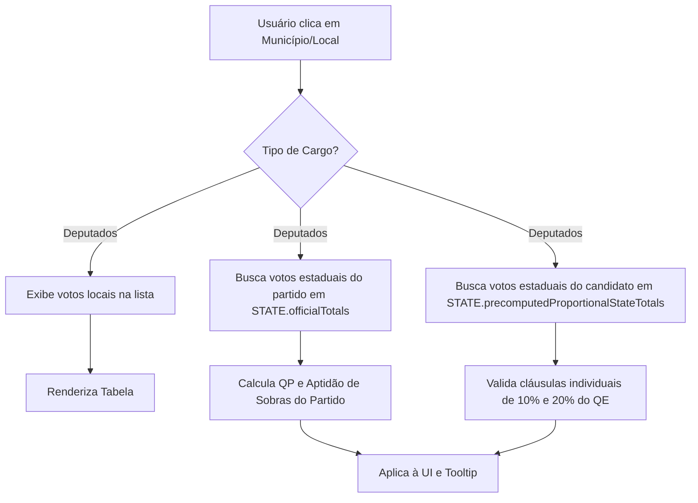

# Resumo Técnico: Ajustes de Escopo Eleitoral e Interface (Deputados e Vereadores)

Este documento detalha as mudanças lógicas e de interface de usuário (UI) realizadas nas telas de resultados proporcionais (Deputado Federal, Deputado Estadual/Distrital e Vereador) do **Visualizador Eleitoral - Observatório**.

As modificações visam garantir a precisão matemática da aplicação da **Lei das Eleições** (QE, QP, Sobras e cláusula 80/20) e simplificar a UI com foco em minimalismo e excelente experiência de uso.

---

## 1. Correção Lógica: Escopo dos Cálculos Proporcionais

> [!IMPORTANT]
> Nas eleições proporcionais para **Deputados Federais e Estaduais**, as vagas são distribuídas com base no desempenho **estadual** dos partidos e candidatos. 
> Nas eleições para **Vereadores**, as vagas baseiam-se no desempenho **municipal** completo.

### O Problema (Antes)
Ao aplicar filtros geográficos de menor escala no mapa (ex: selecionar um Município específico nas eleições de Deputado, ou um Bairro/Local de Votação nas eleições de Vereador), o painel acumulava apenas os votos daquela seleção local.
Como consequência, os algoritmos de validação comparavam os votos **locais** do candidato e do partido contra o **Quociente Eleitoral (QE)** estadual. Isso causava dois erros graves:
1. Partidos com grande representação estadual apareciam erroneamente como *"Inaptos para Sobras (<80%)"* ou com *"QP: 0 direta(s)"* ao selecionar uma cidade menor.
2. Candidatos eleitos apareciam classificados como *"Inaptos"* ou *"Suplentes"* porque seus votos naquela cidade específica ficavam abaixo dos limites individuais de 10% (QP) ou 20% (Sobras) do QE geral.

### A Solução (Depois)
Ajustamos a resolução dos dados proporcionalmente para que, **mesmo com filtros locais ativos**:
- O cálculo da aptidão do partido (se atingiu 80% do QE) e as cadeiras diretas de Quociente Partidário (QP) utilizem os votos **estaduais** oficiais (para deputados) ou os votos **municipais** totais da coligação (para vereadores).
- As validações individuais do candidato (atingir barreira de 10% do QE para vaga direta ou 20% para sobras) consultem o cache global precomputado de totais estaduais/municipais (`precomputedProportionalStateTotals` ou `municipalOfficialTotals`).
- Os votos locais do candidato continuam sendo listados na tabela para análise regional, mas as regras são aplicadas estritamente com base nos totais gerais.

### Quadro Comparativo de Regras

| Métrica Eleitoral | Comportamento Anterior (Incorreto com Filtros) | Comportamento Atual (Correto e Fixo) |
| :--- | :--- | :--- |
| **Votos do Partido** | Somatório exclusivo da área filtrada localmente. | Total oficial do Estado (Deputados) ou Município (Vereador). |
| **QP do Partido** | Calculado sob votos locais (frequentemente resultava em `0`). | Calculado sob votos estaduais/municipais totais da sigla. |
| **Aptidão para Sobras (≥80% QE)** | Comparava soma local contra 80% do QE. | Compara soma estadual/municipal contra 80% do QE. |
| **Barreiras Individuais (10%/20% QE)** | Comparava votos do candidato na cidade contra o QE geral. | Compara votos totais do candidato no estado/cidade contra o QE geral. |

---

## 2. Simplificação da UI: Layout Minimalista

> [!TIP]
> A remoção de informações repetitivas melhora a escaneabilidade dos dados e torna a navegação muito mais fluida.

1. **Remoção de Badges Redundantes**:
   - Excluímos os emblemas coloridos de status (`ELEITO POR MÉDIA`, `ELEITO POR QP`, `SUPLENTE`, `NÃO ELEITO`) que ficavam impressos diretamente abaixo do nome do candidato na tabela da sidebar.
   - O indicador visual primário de eleição permanece sendo o elegante checkmark azul (`✔`) ao lado do nome do eleito.
   - O subtexto do candidato agora exibe apenas a sua sigla partidária (ex: `PL`, `PT`, `MDB`), diminuindo significativamente a altura de cada linha e limpando o layout.

2. **Remoção da Caixa de Dicas (`tipBox`)**:
   - Eliminamos o aviso estático `"💡 Dica do Proporcional..."` que ocupava espaço precioso no topo da lista de resultados na sidebar, otimizando o espaço vertical.

---

## 3. Experiência de Uso: Tooltip Customizado e Integrado

Para manter o painel limpo sem perder a riqueza de detalhes e explicações da legislação eleitoral, integramos um **sistema de tooltip customizado de alta performance** que substitui a caixa de mensagem nativa do navegador.

### Características do Tooltip Premium

- **Design Premium**: Fundo translúcido escuro (`rgba(24, 24, 27, 0.95)`) com efeito de desfoque de fundo por vidro fosco (`backdrop-filter: blur(8px)`), bordas arredondadas e sombra suave de alta profundidade.
- **Micro-interações e Transições**: Transição suave de escala e opacidade ao passar o cursor sobre as linhas dos candidatos (classe `.cand-row-hoverable`).
- **Formatação de Conteúdo**:
  - **Identificação Visual**: Título formatado com ícones e cores dedicadas de acordo com o status (⭐ Dourado para QP, 🟢 Verde para Média, 🔵 Azul para Suplente Apto, 🔴 Vermelho para Inapto).
  - **Nota de Escopo**: Uma linha tracejada sutil separa a explicação caso os votos exibidos localmente difiram dos votos totais estaduais/municipais do candidato, garantindo total transparência ao usuário.
  - **Posicionamento Inteligente**: O elemento acompanha o cursor do mouse e calcula os limites horizontais e verticais da janela do navegador automaticamente, prevenindo cortes nas bordas da tela.

---

## 4. Resumo de Arquivos Modificados

As alterações concentraram-se na separação limpa de lógicas no módulo de renderização de painéis:

### results-panel.js (`js/results-panel.js`)
- Adição da rotina `ensureCustomCandTooltip()` para gerenciar o elemento de tooltip e anexar ouvintes delegados no nível do documento (`mouseover`, `mousemove`, `mouseout`).
- Ajuste das funções `formatTooltipText()` e `positionTooltip()` para formatação com HSL/Aesthetics e posicionamento com limites de viewport.
- Modificação de `renderProportionalExpandableList` para resolver o escopo estadual/municipal do grupo e do candidato, vincular dados ao atributo `data-explanation` e ocultar `statusBadgeHtml` do layout estático.
- Modificação de `renderProportionalModalUI` para aplicar cálculos e progresso com base em `totalPartyStatewideVotes`, substituir o container expansivo `
` por linhas estáticas mais limpas com tooltip no hover, e ajustar o texto informativo de instruções.

### eleicoes.html (`eleicoes.html`)
- Incremento da versão do cache-buster do script para `results-panel.js?v=20260602d` para forçar o recarregamento imediato de todas as novas lógicas de UI e Tooltip no navegador do usuário.
