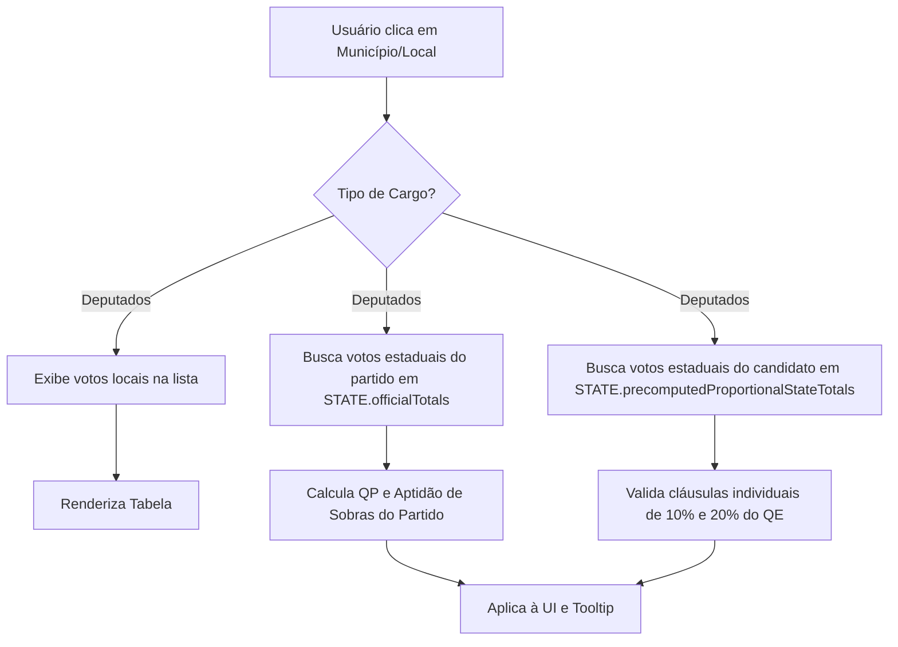

# Resumo Técnico: Ajustes de Escopo Eleitoral e Interface (Deputados e Vereadores)

Este documento detalha as mudanças lógicas e de interface de usuário (UI) realizadas nas telas de resultados proporcionais (Deputado Federal, Deputado Estadual/Distrital e Vereador) do **Visualizador Eleitoral - Observatório**.

As modificações visam garantir a precisão matemática da aplicação da **Lei das Eleições** (QE, QP, Sobras e cláusula 80/20) e simplificar a UI com foco em minimalismo e excelente experiência de uso.

---

## 1. Correção Lógica: Escopo dos Cálculos Proporcionais

> [!IMPORTANT]
> Nas eleições proporcionais para **Deputados Federais e Estaduais**, as vagas são distribuídas com base no desempenho **estadual** dos partidos e candidatos. 
> Nas eleições para **Vereadores**, as vagas baseiam-se no desempenho **municipal** completo.

### O Problema (Antes)
Ao aplicar filtros geográficos de menor escala no mapa (ex: selecionar um Município específico nas eleições de Deputado, ou um Bairro/Local de Votação nas eleições de Vereador), o painel acumulava apenas os votos daquela seleção local.
Como consequência, os algoritmos de validação comparavam os votos **locais** do candidato e do partido contra o **Quociente Eleitoral (QE)** estadual. Isso causava dois erros graves:
1. Partidos com grande representação estadual apareciam erroneamente como *"Inaptos para Sobras (<80%)"* ou com *"QP: 0 direta(s)"* ao selecionar uma cidade menor.
2. Candidatos eleitos apareciam classificados como *"Inaptos"* ou *"Suplentes"* porque seus votos naquela cidade específica ficavam abaixo dos limites individuais de 10% (QP) ou 20% (Sobras) do QE geral.

### A Solução (Depois)
Ajustamos a resolução dos dados proporcionalmente para que, **mesmo com filtros locais ativos**:
- O cálculo da aptidão do partido (se atingiu 80% do QE) e as cadeiras diretas de Quociente Partidário (QP) utilizem os votos **estaduais** oficiais (para deputados) ou os votos **municipais** totais da coligação (para vereadores).
- As validações individuais do candidato (atingir barreira de 10% do QE para vaga direta ou 20% para sobras) consultem o cache global precomputado de totais estaduais/municipais (`precomputedProportionalStateTotals` ou `municipalOfficialTotals`).
- Os votos locais do candidato continuam sendo listados na tabela para análise regional, mas as regras são aplicadas estritamente com base nos totais gerais.

### Quadro Comparativo de Regras

| Métrica Eleitoral | Comportamento Anterior (Incorreto com Filtros) | Comportamento Atual (Correto e Fixo) |
| :--- | :--- | :--- |
| **Votos do Partido** | Somatório exclusivo da área filtrada localmente. | Total oficial do Estado (Deputados) ou Município (Vereador). |
| **QP do Partido** | Calculado sob votos locais (frequentemente resultava em `0`). | Calculado sob votos estaduais/municipais totais da sigla. |
| **Aptidão para Sobras (≥80% QE)** | Comparava soma local contra 80% do QE. | Compara soma estadual/municipal contra 80% do QE. |
| Barreira Individual (10%/20% QE) | Comparava votos do candidato na cidade contra o QE geral. | Compara votos totais do candidato no estado/cidade contra o QE geral. |

### Exceção Especialíssima: Decisão do STF ("Sobras das Sobras")

> [!TIP]
> Um exemplo prático ocorre nas **eleições de Deputado Federal no Amapá em 2022**. Candidatos como *Silvia Waiãpi* foram eleitos por Média mesmo obtendo votação nominal inferior à barreira individual de 20% do QE (que era de 10.575 votos).

O sistema agora detecta e explica essa exceção de forma automática no hover do candidato:
- Se o candidato aparece oficialmente eleito por média, mas sua votação no estado/município é inferior aos 20% do QE exigidos pela Regra 80/20 tradicional, o tooltip reconhece a **terceira fase de partilha de sobras** conforme determinado pelo STF.
- A mensagem é adaptada para esclarecer que, na ausência de mais candidatos aptos que tenham atingido a cláusula de 20%, as vagas remanescentes são distribuídas livremente com base na maior média partidária geral, e a exigência de votação nominal mínima deixa de existir para essa vaga.

### Lógica Temporal Dinâmica (Linha do Tempo 2006-2024)

> [!IMPORTANT]
> A legislação eleitoral brasileira mudou drasticamente ao longo das últimas duas décadas. Para garantir fidelidade aos dados passados, o painel do Observatório agora calcula as regras proporcionais dinamicamente de acordo com o ano da eleição selecionada:

1. **Epoch 1: Até 2016 (Eleições de 2006 a 2016)**
   - *Modelo Tradicional de 2 Fases (Sem barreiras partidárias)*.
   - Distribuição de sobras aberta a qualquer legenda participante (sem barreira de 80% ou 100% do QE para o partido).
   - Sem cláusula de barreira nominal individual para o candidato (votos mínimos de 10% do QE só foram instituídos a partir de 2016 para vagas de QP).
   - *Interface*: O painel e o tooltip ocultam qualquer termo de inaptidão ou barreiras de quociente, mantendo a exatidão histórica.

2. **Epoch 2: Eleições de 2018 e 2020 (A Restrição Total)**
   - *Modelo de 3 Fases (Restrito)* sob a Lei nº 13.488/2017.
   - Na 2ª Fase (Sobras), **somente partidos que atingiram 100% do QE** puderam concorrer. Candidatos precisavam de no mínimo 10% do QE nominal individual.
   - Na 3ª Fase (Repescagem), caso restassem vagas que não pudessem ser preenchidas sob a regra restrita, a exigência de 100% do QE para o partido caía, permitindo a concorrência de todas as legendas pela maior média sucessiva.

3. **Epoch 3: Eleições de 2022 em Diante (A Regra 80/20)**
   - *Modelo Atual de 3 Fases* sob a Lei nº 14.211/2021.
   - Na 2ª Fase (Sobras), vigora a barreira de **80% do QE para o partido** e **20% do QE para o candidato**.
   - Na 3ª Fase ("Sobras das Sobras"), devido à decisão de inconstitucionalidade do STF in 2024, as barreiras de 80% e 20% caem, permitindo a concorrência ampla de todas as legendas e elegendo o candidato de maior votação nominal, independente do seu número de votos.

---

## 2. Simplificação da UI: Layout Minimalista

> [!TIP]
> A remoção de informações repetitivas melhora a escaneabilidade dos dados e torna a navegação muito mais fluida.

1. **Remoção de Badges Redundantes**:
   - Excluímos os emblemas coloridos de status (`ELEITO POR MÉDIA`, `ELEITO POR QP`, `SUPLENTE`, `NÃO ELEITO`) que ficavam impressos diretamente abaixo do nome do candidato na tabela da sidebar.
   - O indicador visual primário de eleição permanece sendo o elegante checkmark azul (`✔`) ao lado do nome do eleito.
   - O subtexto do candidato agora exibe apenas a sua sigla partidária (ex: `PL`, `PT`, `MDB`), diminuindo significativamente a altura de cada linha e limpando o layout.

2. **Remoção da Caixa de Dicas (`tipBox`)**:
   - Eliminamos o aviso estático `"💡 Dica do Proporcional..."` que ocupava espaço precioso no topo da lista de resultados na sidebar, otimizando o espaço vertical.

---

## 3. Experiência de Uso: Tooltip Customizado e Integrado

Para manter o painel limpo sem perder a riqueza de detalhes e explicações da legislação eleitoral, integramos um **sistema de tooltip customizado de alta performance** que substitui a caixa de mensagem nativa do navegador.

### Características do Tooltip Premium

- **Design Premium**: Fundo translúcido escuro (`rgba(24, 24, 27, 0.95)`) com efeito de desfoque de fundo por vidro fosco (`backdrop-filter: blur(8px)`), bordas arredondadas e sombra suave de alta profundidade.
- **Micro-interações e Transições**: Transição suave de escala e opacidade ao passar o cursor sobre as linhas dos candidatos (classe `.cand-row-hoverable`).
- **Formatação de Conteúdo**:
  - **Identificação Visual**: Título formatado com ícones e cores dedicadas de acordo com o status (⭐ Dourado para QP, 🟢 Verde para Média, 🔵 Azul para Suplente Apto, 🔴 Vermelho para Inapto).
  - **Nota de Escopo**: Uma linha tracejada sutil separa a explicação caso os votos exibidos localmente difiram dos votos totais estaduais/municipais do candidato, garantindo total transparência ao usuário.
  - **Posicionamento Inteligente**: O elemento acompanha o cursor do mouse e calcula os limites horizontais e verticais da janela do navegador automaticamente, prevenindo cortes nas bordas da tela.
- **Integração Total na UI**: O mesmo tooltip premium de alta fidelidade é aplicado tanto nas listas de candidatos do painel lateral quanto nas linhas de candidatos no modal de detalhes da coligação, garantindo consistência visual em toda a plataforma e eliminando de vez as caixas amarelas nativas do navegador.

---

## 4. Resumo de Arquivos Modificados

As alterações concentraram-se na separação limpa de lógicas no módulo de renderização de painéis:

### [MODIFY] [results-panel.js](file:///c:/mapas/Observatorio/js/results-panel.js)
- Adição da rotina `ensureCustomCandTooltip()` para gerenciar o elemento de tooltip e anexar ouvintes delegados no nível do documento (`mouseover`, `mousemove`, `mouseout`).
- Ajuste das funções `formatTooltipText()` e `positionTooltip()` para formatação com HSL/Aesthetics e posicionamento com limites de viewport.
- Modificação de `renderProportionalExpandableList` para resolver o escopo estadual/municipal do grupo e do candidato, vincular dados ao atributo `data-explanation` e ocultar `statusBadgeHtml` do layout estático.
- Modificação de `renderProportionalModalUI` para aplicar cálculos e progresso com base em `totalPartyStatewideVotes`, substituir o container expansivo `
` por linhas estáticas mais limpas com tooltip no hover, e ajustar o texto informativo de instruções.
- Integração do tooltip dinâmico no modal (`data-explanation` e classe `cand-row-hoverable` aplicados a `.cand-details-card`).
- **Correção Crítica (Colisão de Status de Candidatos)**: Correção nas validações das strings de status no loop de renderização (do painel lateral e do modal). Substituição dos testes de substring baseados em `.includes(...)` por comparações de igualdade estrita (`===`). Isso sanou um bug em que candidatos com status `"NÃO ELEITO"` entravam indevidamente no caso de teste `"ELEITO"` (já que `"NÃO ELEITO"` contém `"ELEITO"`), resultando em mensagens de sucesso falsas positivas no hover para suplentes/não eleitos.
- **Sincronização de Visibilidade**: Atualização da rotina `updateToggleRulesButtonVisibility` para alternar também a exibição do botão `#btnExplainRules` de acordo com a visibilidade das regras e a configuração ativa.

### [MODIFY] [eleicoes.html](file:///c:/mapas/Observatorio/eleicoes.html)
- Adição do botão `#btnExplainRules` ("Como funciona") ao painel de controle de resultados, posicionado ao lado do botão de alternância de regras, totalmente padronizado (sem emojis).
- Criação da janela modal interativa `#rulesExplainOverlay` com layout completo de abas, fluxogramas estilizados em CSS/HTML, métricas ilustradas e explicações aprofundadas das três épocas de regras proporcionais (2006-2016, 2018-2020 e 2022-presente), sem emojis.
- **Detalhamento Jurídico**: Expansão dos textos de explicação com base no Código Eleitoral (Artigos 106, 107, 108 e 109) e na jurisprudência do STF (**ADIs 7228, 7263 e 7325**). Explicações minuciosas sobre a apuração do QE (Quociente Eleitoral), QP (Quociente Partidário), barreiras de desempenho individual (10% e 20% do QE) e as três fases de sobras e médias. Lógica reescrita de forma didática e direta para esclarecer a seleção partidária pelo QE na Fase 1, e a disputa ampla de sobras por média na Fase 2 com barreiras de 80% (legenda) e 20% (candidato).
- **Fórmula da Média de Sobras**: Inclusão de container didático com a fórmula matemática `Média = Votos Válidos do Partido / (Vagas Conquistadas + 1)` detalhando cada variável (Art. 109, I).
- **Caso Prático do Amapá (AP/2022)**: Expansão do exemplo de *Silvia Waiãpi* para explicar passo a passo (Fases 1, 2 e 3) a distribuição das 8 vagas federais com as médias de cada rodada, demonstrando a distorção que motivou o julgamento de inconstitucionalidade pelo STF em 2024. Adição de resumo técnico sobre o desfecho prático das eleições de 2022 no Amapá após a retotalização ordenada pelo STF/TSE em setembro de 2024 (perda de mandato de Silvia Waiãpi, Sonize Barbosa, Maria Goreth e Dr. Pupio, substituídos por André Abdon, Aline Gurgel, Marcivânia Flexa e Paulo Lemos).
- **Caso Prático de Lucas Gonzalez (MG/2022)**: Correção dos dados estáticos para refletir os números reais da eleição (votos nominais de Lucas Gonzalez atualizados para 41.833, e barreira individual nominal de 20% do QE ajustada para 42.193).
- **Aviso de Inconstitucionalidade nos Tooltips**: Modificação da rotina de tooltips de candidatos eleitos por média na 3ª fase (exceção do STF) para alertar que os dados exibidos dizem respeito à aplicação original de 2022 antes da retotalização e do cancelamento dos mandatos decorrentes da decisão de inconstitucionalidade.
- **Correção Crítica (Ninhada de Divs)**: Reinserção de duas tags de fechamento `
` correspondentes ao `#guideOverlay` (modal e conteúdo do guia) que haviam sido acidentalmente removidas no escopo de inserção do overlay de regras. Esse erro causava o aninhamento indevido de todo o rodapé do documento (incluindo as tags `<script>` e o novo modal) dentro de um elemento invisível (`#guideOverlay`), impedindo a renderização correta do modal e execução das funções no clique do botão.
- Incremento da versão do cache-buster dos scripts para `v=20260603d` para forçar o recarregamento imediato.

### [MODIFY] [style.css](file:///c:/mapas/Observatorio/style.css)
- Implementação de estilos CSS premium para a interface do modal de regras: barras de abas (`.rules-tab-bar` e `.rules-tab-btn`), contêineres de fase com cores de acento (`.rules-phase-card.phase-1/2/3`), caixas de fluxogramas (`.rules-diagram-box`), indicadores de progresso de quocientes (`.diagram-bar-container` e `.diagram-bar-fill`), badges e cartões de exemplo com grid responsivo (`.rules-example-card`).

### [MODIFY] [ui-helpers.js](file:///c:/mapas/Observatorio/js/ui-helpers.js)
- Mapeamento das novas variáveis do DOM (`dom.btnExplainRules`, `dom.rulesExplainOverlay`, `dom.btnCloseRulesExplain`).

### [MODIFY] [ui-controls.js](file:///c:/mapas/Observatorio/js/ui-controls.js)
- Vinculação dos ouvintes de evento para abertura e fechamento do modal de regras.
- Implementação da lógica de pré-seleção inteligente de aba: ao abrir o modal, o sistema detecta automaticamente o ano da eleição ativa (`STATE.currentElectionYear`) e exibe por padrão a aba de regras histórica correspondente (ex: aba de 2022-presente ao visualizar eleições de 2022 ou 2024).
- Adição de lógica para troca dinâmica de abas internas no modal de regras sem necessidade de recarregamento.
